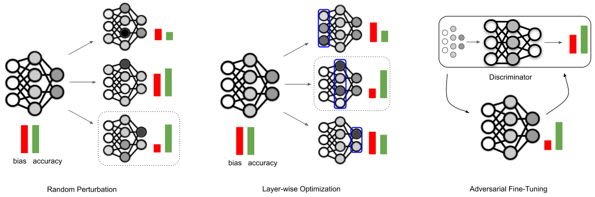
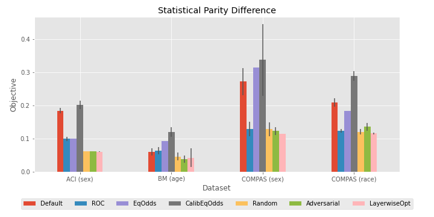
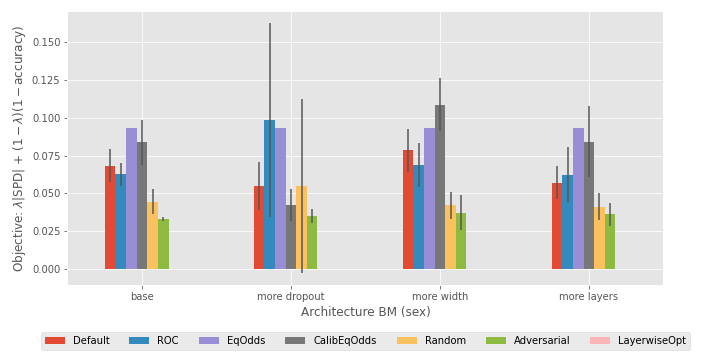

# Post-Hoc Methods for Debiasing Neural Networks

[Post-Hoc Methods for Debiasing Neural Networks](https://arxiv.org/abs/2006.08564)\
Yash Savani, Colin White, Naveen Sundar Govindarajulu.\
_arXiv:2006.08564_.

## Three New Post-Hoc Techniques
In this work, we introduce three new fine-tuning techniques to reduce bias in pretrained neural networks: random perturbation, layer-wise optimization, and adversarial fine-tuning. All three techniques work for any group fairness constraint. We include code that compares our three proposed methods with three popular post-processing methods, across three datasets provided by [aif360](https://aif360.readthedocs.io/en/latest/modules/datasets.html), and three popular bias measures.

<p align="center">

</p>

## Requirements
- pyyaml
- numpy
- torch
- aif360 == 0.3.0rc0
- sklearn
- numba
- jupyter

Install the requirements using 
```
$ pip install -r requirements.txt
```

## How to debias your own neural network
### What you need:
* Model architecture (currently supported PyTorch Module)
* Model checkpoint (currently supported file type: .pt)
* Validation dataset that you are going to debias based on
  * Very simple if your model uses one of these 10 datasets https://pytorch.org/docs/stable/torchvision/datasets.html
  * For a custom dataset, make a quick DataLoader class using this tutorial https://pytorch.org/tutorials/beginner/data_loading_tutorial.html 
* Protected attribute (e.g., “race”)
* Prediction attribute (e.g., “smiling”)
* (optional) tunable bias parameter lambda 
  * lambda=0.9 means, I want my model to be almost fully debiased 
  * lambda=0.1 means, I care a lot about accuracy and minimally about debiasing
  * We recommend lambda between 0.5 and 0.75 

### Steps to debias your model

Follow the example given in `test_post_hoc_lib.py`. You will need to inherit from `DebiasModel` class in `post_hoc_lib.py` and overwrite the following methods with appropriate ones for your model:

* `def get_valloader(self):`
  * This should return a `torch.utils.data.DataLoader` that iterates over your validation set. Each iteration should return an input batch and an output binary batch vector that includes the protected attribute and prediction attribute along some index.
* `def get_testloader(self):`
  * This should return a `torch.utils.data.DataLoader` with the same parameters as the valloader, except with the test set. This is used for evaluation of the models
* `def protected_index(self):`
  * This should return the index for your protected attribute
* `def prediction_index(self):`
  * This should return the index for your prediction attribute
* `def get_model(self):`
  * This should return the model architecture with the loaded weights from the checkpoint
* `def get_last_layer_name(self):`
  * This should return the name of the last layer of the model.

You can also overwrite the lambda parameter and the bias measure you want to use for the objective in the `__init__` constructor for your class. To overwrite the lambda parameter change the `self.lam` attribue, to overwrite the bias measure change the `self.bias_measure` attribute to one of 'spd', 'eod', or 'aod'.

Once you have overwritten the methods and parameters, you can execute the following code

```
# CustomModel is a subclass of DebiasModel.
custom_model = CustomModel()
# This returns a dictionary containing bias statistics for the original model.
# If verbose is True, then it prints out the bias statistics.
orig_data = custom_model.evaluate_original(verbose=True)

# This runs the random debiasing algorithm on the model and returns
# the random debiased model and the random threshold that will minimize the objective.
rand_model, rand_thresh = custom_model.random_debias_model()
# This returns a dictionary containing bias statistics for the random debiased model.
# If verbose is True, then it prints out the bias statistics.
rand_data = custom_model.evaluate_random_debiased(verbose=True)

# This runs the adversarial debiasing algorithm on the model and returns
# the adversarial debiased model and the adversarial threshold that will minimize the objective.
adv_model, adv_thresh = custom_model.adversarial_debias_model()
# This returns a dictionary containing bias statistics for the adversarial debiased model.
# If verbose is True, then it prints out the bias statistics.
adv_data = custom_model.evaluate_adversarial_debiased(verbose=True)
```

## Run our Post-Hoc debiasing experiments

### Step 1 - Create Configs
Create a config yaml file required to run the experiment by running 

```
$ python create_configs.py <dataset> <bias measure> <protected variable> <number of replications>
```
For example:
```
$ python create_configs.py adult spd 1 10
```

where <dataset> is one of "adult" (ACI), "bank" (BM), or "compas" (COMPAS), <bias measure> is one of "spd" (statistical parity difference), "eod" (equal opportunity difference), or "aod" (average odds difference), <protected variable> is 1 or 2 (described below), and <number of replications> is the number of trials to run, which can be any positive integer. This will create a config directory `<dataset>_<bias measure>_<protected variable>` (for example `adult_spd_1`) including all the corresponding config files for the experiment.

A table describing the relationship between the protected variable index and dataset is given below.

| dataset   | 1   | 2    |
|:----------|:----|:-----|
| adult     | sex | race |
| compas    | sex | race |
| bank      | age | race |

To automatically create all 12 experiments used in the paper, run

```
$ bash create_all_configs.sh
```

### Step 2 - Run Experiments
Run all the experiments described by the config files in the config directory created in Step 1 by running 

```
$ python run_experiments.py <config directory>
```
For example
```
$ python run_experiments.py adult_spd_1/
```

This will run a `posthoc.py` experiment for each config file in the config directory. All the biased, pretrained neural network models are saved in the `models/` directory. All the results from the experiments are saved in the `results/` directory in JSON format.

The `posthoc.py` includes benchmark code for the 3 post-processing debiasing techniques provided by the [aif360](https://aif360.readthedocs.io/en/latest/modules/algorithms.html#module-aif360.algorithms.postprocessing) framework: reject option classification, equalized odds postprocessing, and calibrated equalized odds postprocessing. It also includes code for the random perturbation, and adversarial fine-tuning algorithms. To get results for the layer-wise optimization technique, follow the instructions in the deco directory.

### Step 3 - Analyze Results
To analyze the results of the experiments and get the plots shown below you can run through the `analyze_results.ipynb` jupyter notebook.


<p align="center">
  
  
  
</p>

### Step 4 - Cleanup configs

To clean up the config directories run 
```
$ bash cleanup.sh
```