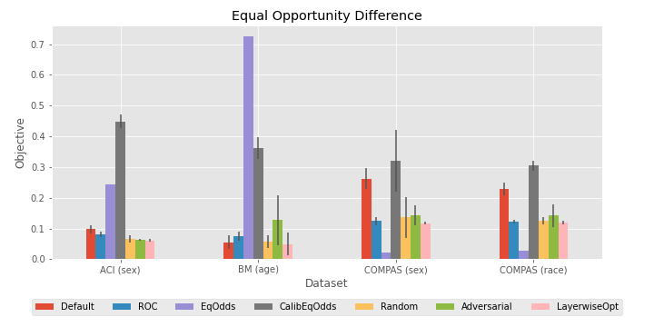
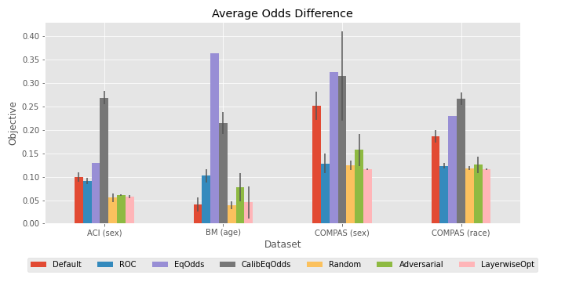
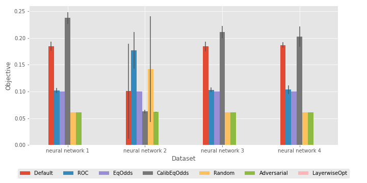

# Post-Hoc Methods for Debiasing Neural Networks

Post-Hoc Methods for Debiasing Neural Networks
Yash Savani, Colin White, Naveen Sundar G

## Three New Post-Hoc Techniques
In this work, we introduce three new fine-tuning techniques to reduce bias in pretrained neural networks: random perturbation, layer-wise optimization, and adversarial fine-tuning. All three techniques work for any group fairness constraint. We include code that compares our three proposed methods with three popular post-processing methods, across three datasets provided by [aif360](https://aif360.readthedocs.io/en/latest/modules/datasets.html), and three popular bias measures.

## Requirements
- pyyaml
- numpy
- torch
- aif360 == 0.3.0rc0
- sklearn
- numba
- jupyter

## Run a Post-Hoc debiasing experiment

### Step 1 - Create Configs
Create a config yaml file required to run the experiment by running 

```
$ python create_configs.py <dataset> <bias measure> <protected variable> <number of replications>
```
For example:
```
$ python create_configs.py adult spd 1 10
```

where dataset is one of "adult" (ACI), "bank" (BM), or "compas" (COMPAS), bias measure is one of "spd" (statistical parity difference), "eod" (equal opportunity difference), or "aod" (average odds difference), protected variable is one of 1 (gender), 2 (race), and the number of replications is any positive integer depending on the desired test power. This will create a config directory `<dataset>_<bias measure>_<protected variable>` (for example `adult_spd_1`) including all the corresponding config files for the experiment.

If you want to automatically create all 12 experiments used in the paper, run

```
$ bash create_all_configs.sh
```

### Step 2 - Run Experiments
Run all the experiments described by the config files in the config directory created in Step 1 by running 

```
$ python run_experiments.py <config directory>
```
For example
```
$ python run_experiments.py adult_spd_1/
```

This will run a `posthoc.py` experiment for each config file in the config directory. All the biased, pretrained neural network models are saved in the `models/` directory. All the results from the experiments are saved in the `results/` directory in JSON format.

The `posthoc.py` includes benchmark code for the 3 post-processing debiasing techniques provided by the [aif360](https://aif360.readthedocs.io/en/latest/modules/algorithms.html#module-aif360.algorithms.postprocessing) framework: reject option classification, equalized odds postprocessing, and calibrated equalized odds postprocessing. It also includes code for the random perturbation, and adversarial fine-tuning algorithms. To get results for the layer-wise optimization technique, follow the instructions in the deco directory.

### Step 3 - Analyze Results
To an analyze the results of the experiments and get the plots shown below you can run through the `analyze_results.ipynb` jupyter notebook.


<p align="center">
  
  
  
  
</p>

### Step 4 - Cleanup configs

To clean up the config directories run 
```
$ bash cleanup.sh
```
